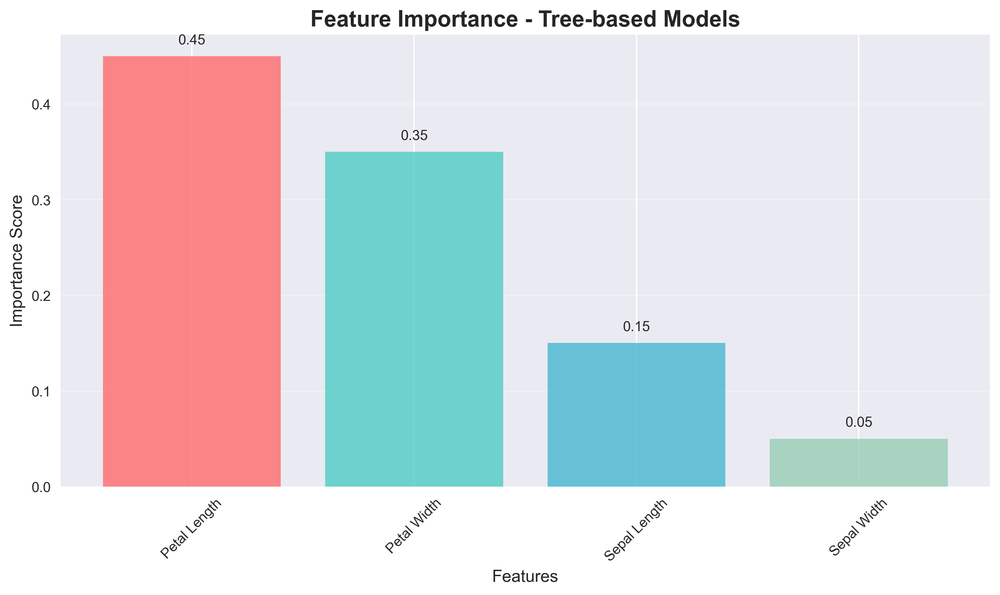

# Automated Experiments Report

Generated on: 2025-12-26T00:59:09.780387

## Summary Statistics

- **Total Experiments**: 0
- **Best Accuracy**: 0.0000
- **Average Accuracy**: 0.0000
- **Standard Deviation**: 0.0000

## Visualizations

### Performance Comparison

### Confusion Matrix

### Feature Importance

## Charts Generated

- feature_importance.png

---
*Report automatically generated by generate_visual_reports.py*
